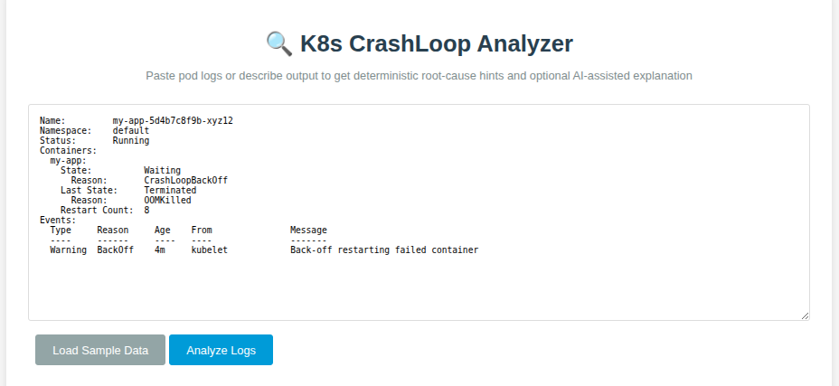
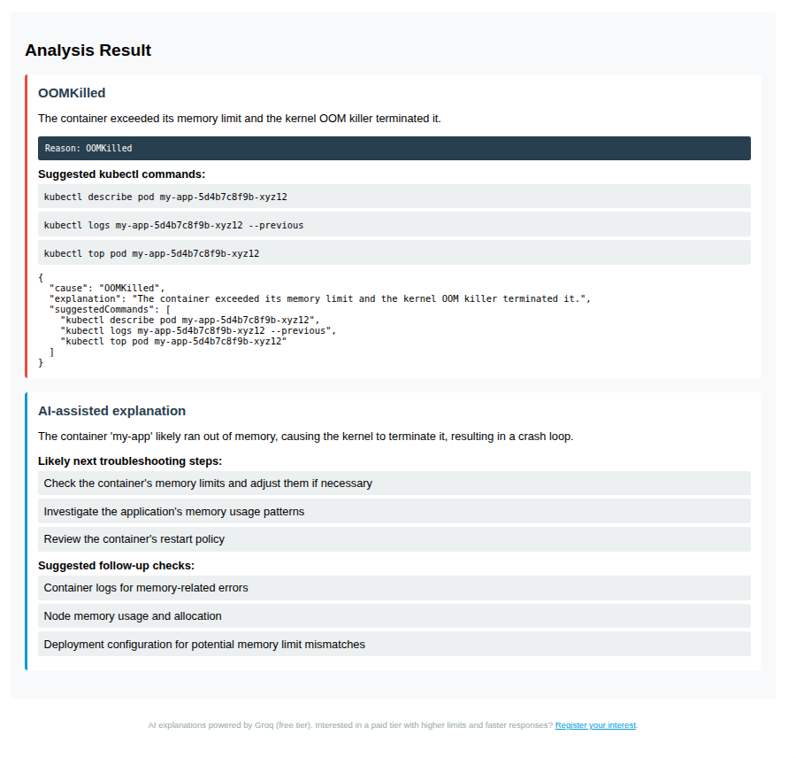

# K8s CrashLoop Analyzer

A Kubernetes CrashLoopBackOff debugging tool that combines deterministic failure-pattern detection with optional AI-assisted explanation.





## Problem Statement

Debugging `CrashLoopBackOff` is often slow and manual. Engineers switch between `kubectl describe`, prior container logs, and cluster events to identify root causes under pressure.

## Feature Overview

- Deterministic rule engine is the primary source of truth.
- Rule matching detects common failure patterns from pasted logs/describe output.
- Returns:
  - likely cause
  - deterministic explanation
  - suggested `kubectl` commands
- Optional Groq-based AI explanation adds concise guidance if configured.
- AI calls are server-side only.

## Example Input / Output

### Input

```text
State:          Waiting
  Reason:       CrashLoopBackOff
Last State:     Terminated
  Reason:       OOMKilled
```

### Deterministic Output

```json
{
  "cause": "OOMKilled",
  "explanation": "The container exceeded its memory limit and the kernel OOM killer terminated it.",
  "suggestedCommands": [
    "kubectl describe pod <pod>",
    "kubectl logs <pod> --previous",
    "kubectl top pod <pod>"
  ]
}
```

### Optional AI-assisted Output

```json
{
  "summary": "The container likely exceeded memory limits during startup and was restarted.",
  "next_steps": [
    "kubectl top pod my-app-5d4b7c8f9b-xyz12 -n default",
    "kubectl logs my-app-5d4b7c8f9b-xyz12 --previous -n default",
    "kubectl describe pod my-app-5d4b7c8f9b-xyz12 -n default"
  ],
  "suggested_checks": [
    "kubectl get pod my-app-5d4b7c8f9b-xyz12 -o jsonpath='{.spec.containers[*].resources}'",
    "kubectl get events -n default --sort-by=.lastTimestamp"
  ]
}
```

The AI returns **runnable kubectl commands** using the actual pod, deployment, and namespace names from the pasted logs — not generic advice.

## Architecture Overview

1. Frontend (`public/analyzer.js`) runs deterministic detection first. This mirrors typical Kubernetes debugging workflows where engineers first identify common failure patterns before investigating deeper system causes.
2. UI immediately renders deterministic output.
3. Optional step calls `/api/ai-explanation` for AI explanation.
4. Server-side explainer (`server/llm-explainer.js`) returns concise JSON or gracefully skips.

Deterministic analysis still works when no API key is configured.

## Supported Failure Patterns

- `OOMKilled`
- `ImagePullBackOff` / `ErrImagePull`
- `CreateContainerConfigError` (missing ConfigMap or Secret)
- `CrashLoopBackOff` caused by missing environment/config values
- Generic `CrashLoopBackOff` fallback
- Port binding failure (for example, `address already in use`)

## AI Setup (Groq — free tier)

Get a free API key: https://console.groq.com

Uses `llama-3.3-70b-versatile` with 30 RPM / 14,400 RPD on the free tier.

Set environment variable `GROQ_API_KEY`.

### Local Development

1. Copy `.env.example` to `.env`.
2. Set `GROQ_API_KEY` in `.env`.
3. Install dependencies:

```bash
npm install
```

4. Start local server:

```bash
npm start
```

5. Open:

```text
http://localhost:8000
```

If `GROQ_API_KEY` is missing or the provider fails, deterministic output still works and AI output is skipped.

### Vercel Deployment

Set `GROQ_API_KEY` in Vercel Dashboard:

`Project Settings -> Environment Variables`

Vercel injects this env var at runtime; `dotenv` is only for local dev.

## Rate Limiting

`/api/ai-explanation` is limited to 10 requests per minute per IP (in-memory).

The AI provider (Groq free tier) has a limit of 30 requests per minute. If the limit is hit, users see a friendly message suggesting they wait and try again.

## Paid Tier Interest

This tool currently runs on Groq's free tier. If there's enough interest, a paid tier with higher limits, faster responses, and additional features may be offered.

[Register your interest here](https://forms.gle/W2xPf67LTkpf3CuS7) — I'll only reach out if a paid option becomes available.

## Project Structure

- `public/` static frontend (`index.html`, `analyzer.js`)
- `api/ai-explanation.js` Vercel serverless AI endpoint
- `server/llm-explainer.js` provider integration and fallback
- `server.js` local development server (serves only `public/`)

## Testing

```bash
npm test
```
